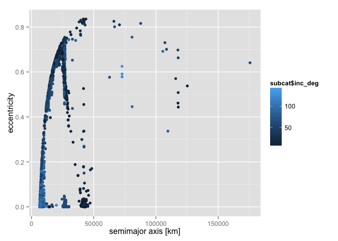
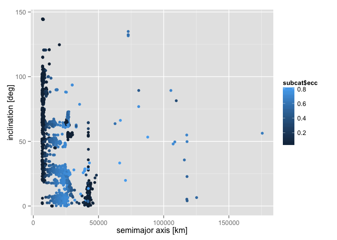
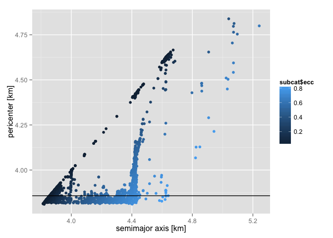
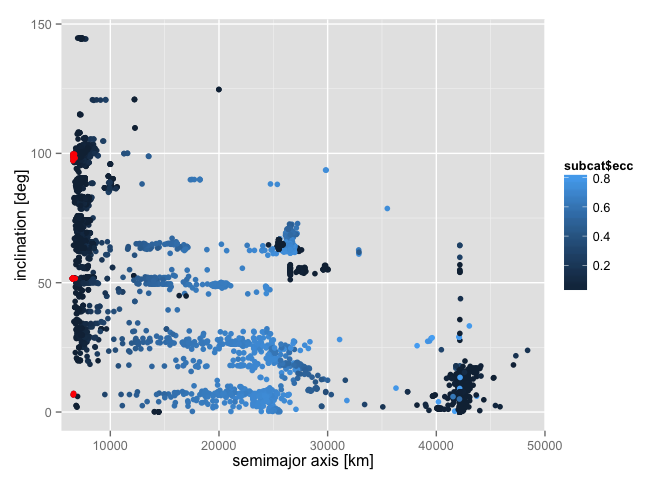
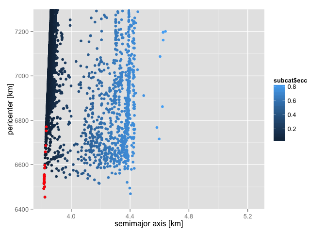
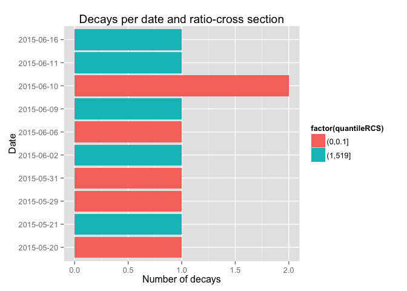
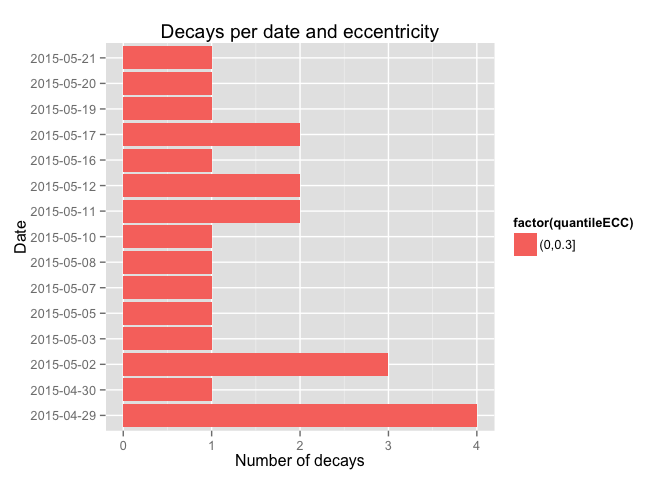
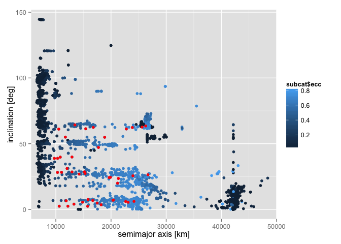
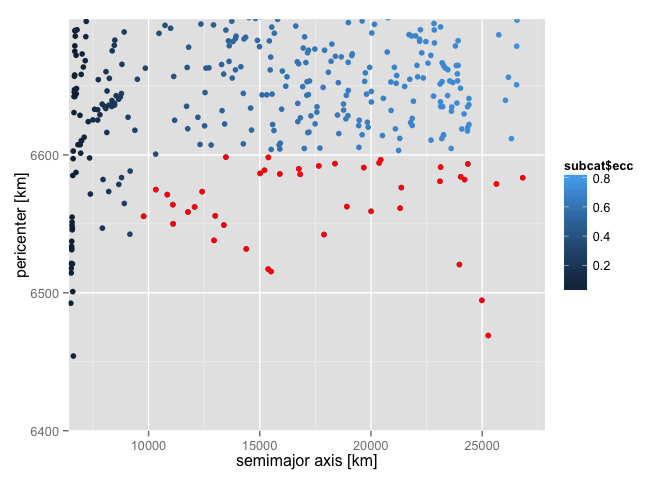

Satellite Orbit and Decay Analysis
======================================================

## Synopsis
Given the satellite orbits and physical parameters catalogue, we want to select those that are in eccentric orbits and are are going to re-enter the Earth atmosphere. That is the ratio-cross section must be greater that 1.0 and perigee less than 6600 km.


```r
library(dplyr)
```

```
## 
## Attaching package: 'dplyr'
## 
## The following object is masked from 'package:stats':
## 
##     filter
## 
## The following objects are masked from 'package:base':
## 
##     intersect, setdiff, setequal, union
```

```r
library(ggplot2)
library(Hmisc)
```

```
## Loading required package: grid
## Loading required package: lattice
## Loading required package: survival
## Loading required package: Formula
## 
## Attaching package: 'Hmisc'
## 
## The following objects are masked from 'package:dplyr':
## 
##     combine, src, summarize
## 
## The following objects are masked from 'package:base':
## 
##     format.pval, round.POSIXt, trunc.POSIXt, units
```

## Raw data

The catalog `tle_latest.txt` is taken form space-track.org:

```
## 0 VANGUARD 1
## 1 00005U 58002B   15170.04478724  .00000352  00000-0  47355-3 0  9997
## 2 00005 034.2454 090.7354 1846492 059.2462 317.7032 10.84627234  7118
## 0 VANGUARD 2
## 1 00011U 59001A   15170.01411907  .00001030  00000-0  56263-3 0  9993
## 2 00011 032.8679 066.2094 1468790 030.4671 337.3573 11.84984184400049
## =====================================================================
## Number of objects: 15063  (no. of rwos:    45189 )
```

The catalog `satcat.txt` (containing the physical parameters) comes from celestrak.com:

```
## 1957-001A    00001   D SL-1 R/B                  CIS    1957-10-04  TYMSC  1957-12-01     96.2   65.1     938     214   20.4200     
## 1957-001B    00002  *D SPUTNIK 1                 CIS    1957-10-04  TYMSC  1958-01-03     96.1   65.0     945     227     N/A       
## 1957-002A    00003  *D SPUTNIK 2                 CIS    1957-11-03  TYMSC  1958-04-14    103.7   65.3    1659     211    0.0800     
## =====================================================================
## Number of objects:    40696
```

An explanation fro the variables can be found in the docs folder.

### Process data
To process `TLE_LATEST.TXT` into a table containing the Keplerian orbital elements, create a symbolic link or a copy of it and name it `file.fla`.

```sh
rm -f file.txt
ln -s tle_latest.txt file.txt
```

Then, compile the fortran file `TLE2KEP.f90` (with gfortran, ifort, etc.) and run the executable to transform the 2 lines element catalog in a table format. The output is a file called `file_oe.fla`.

```sh
gfortran TLE2KEP.f90 -o TLE2KEP
./TLE2KEP
```

```
## NORAD_ID       sma_meter            ecc        inc_deg       RAAN_deg       argp_deg          M_deg
##        5    8620811.9400     0.18464920    34.24540000    90.73540000    59.24620000   317.70320000
##       11    8126935.3566     0.14687900    32.86790000    66.20940000    30.46710000   337.35730000
##       12    8321295.8205     0.16670280    32.90290000   257.84880000   198.55490000   154.63530000
##       16    8817568.7240     0.20241200    34.26430000    31.84860000    91.78280000   291.40680000
##       20    8267584.1866     0.16704850    33.35000000   201.84670000   308.37270000    37.79970000
## =====================================================================
## Number of objects: 15063
```


To process `SATCAT.TXT` we need change the delimiter of the table (missing values are represented by empty strings and not all can be recognised by R). Compile the fortran code `SAT2TABLE.f90` and run the executable. It will also add an header. The output is a file called `satcat.fla`.

```sh
gfortran SAT2TABLE.f90 -o SAT2TABLE
./SAT2TABLE
```

```
## head: satcat.fla[,1:8]: No such file or directory
## =====================================================================
## Number of objects: 40696
```

Read the data assigning the right format and merge the two catalogues (here using R)

```r
tlecat <- tbl_df(read.table(file = "file_oe.fla", header = TRUE, dec = "."))
tlecat
```

```
## Source: local data frame [15,063 x 7]
## 
##    NORAD_ID sma_meter       ecc inc_deg RAAN_deg argp_deg    M_deg
## 1         5   8620812 0.1846492 34.2454  90.7354  59.2462 317.7032
## 2        11   8126935 0.1468790 32.8679  66.2094  30.4671 337.3573
## 3        12   8321296 0.1667028 32.9029 257.8488 198.5549 154.6353
## 4        16   8817569 0.2024120 34.2643  31.8486  91.7828 291.4068
## 5        20   8267584 0.1670485 33.3500 201.8467 308.3727  37.7997
## 6        22   6969306 0.0147451 50.2843  14.1713 135.0238 226.2762
## 7        29   7027014 0.0024351 48.3805 285.1428 340.0913  19.9046
## 8        45   7158660 0.0259822 66.6930 152.1647 206.1520 152.6267
## 9        46   7108564 0.0206027 66.6915 302.9777  51.7836 310.1621
## 10       47   7131228 0.0231614 66.6662 354.6617 200.2600 158.9202
## ..      ...       ...       ...     ...      ...      ...      ...
```

```r
satcat <- tbl_df(read.table(file = "satcat.fla", header = TRUE, dec = ".", sep = "|",na.string=""))
satcat$DECAY <- as.Date(satcat$DECAY)
satcat$LAUNCH <- as.Date(satcat$LAUNCH)
satcat
```

```
## Source: local data frame [34,970 x 14]
## 
##    NORAD_ID                  SATNAME      INTDES        TYPE     COUNTRY
## 1         1 SL-1 R/B                 1957-001A   ROCKET_BOBY CIS        
## 2         2 SPUTNIK 1                1957-001B       PAYLOAD CIS        
## 3         3 SPUTNIK 2                1957-002A       PAYLOAD CIS        
## 4         4 EXPLORER 1               1958-001A       PAYLOAD US         
## 5         5 VANGUARD 1               1958-002B       PAYLOAD US         
## 6         6 EXPLORER 3               1958-003A       PAYLOAD US         
## 7         7 SL-1 R/B                 1958-004A   ROCKET_BOBY CIS        
## 8         8 SPUTNIK 3                1958-004B       PAYLOAD CIS        
## 9         9 EXPLORER 4               1958-005A       PAYLOAD US         
## 10       10 SCORE                    1958-006A       PAYLOAD US         
## ..      ...                      ...         ...         ...         ...
## Variables not shown: LAUNCH (date), SITE (fctr), DECAY (date), PERIOD
##   (dbl), INCL (dbl), APO (dbl), PERI (dbl), RCS (dbl), STATUS (fctr)
```

```r
mergecat <- tbl_df(merge(tlecat,satcat,by=c("NORAD_ID")))
```

We are only interseted in a subset of the catalog:

```r
subcat <- select(mergecat,NORAD_ID,sma_meter,ecc,inc_deg,RAAN_deg,argp_deg,M_deg,LAUNCH,DECAY,RCS)
subcat
```

```
## Source: local data frame [12,081 x 10]
## 
##    NORAD_ID sma_meter       ecc inc_deg RAAN_deg argp_deg    M_deg
## 1         5   8620812 0.1846492 34.2454  90.7354  59.2462 317.7032
## 2        11   8126935 0.1468790 32.8679  66.2094  30.4671 337.3573
## 3        12   8321296 0.1667028 32.9029 257.8488 198.5549 154.6353
## 4        16   8817569 0.2024120 34.2643  31.8486  91.7828 291.4068
## 5        20   8267584 0.1670485 33.3500 201.8467 308.3727  37.7997
## 6        22   6969306 0.0147451 50.2843  14.1713 135.0238 226.2762
## 7        29   7027014 0.0024351 48.3805 285.1428 340.0913  19.9046
## 8        45   7158660 0.0259822 66.6930 152.1647 206.1520 152.6267
## 9        46   7108564 0.0206027 66.6915 302.9777  51.7836 310.1621
## 10       47   7131228 0.0231614 66.6662 354.6617 200.2600 158.9202
## ..      ...       ...       ...     ...      ...      ...      ...
## Variables not shown: LAUNCH (date), DECAY (date), RCS (dbl)
```

Here are some plots.

 

 

 

Let's see whose satellite/debris decay and when, their dimension (cross section) their eccentricity:

```r
sum(!is.na(subcat$DECAY))
```

```
## [1] 11
```

```r
subcat_decay <- filter(subcat, !is.na(DECAY))
subcat_decay <- group_by(subcat_decay,DECAY)
select(subcat_decay,DECAY,RCS,ecc)
```

```
## Source: local data frame [11 x 3]
## Groups: DECAY
## 
##         DECAY      RCS       ecc
## 1  2015-06-06   0.0260 0.0021092
## 2  2015-06-16  10.8128 0.0001344
## 3  2015-05-20   0.0240 0.0011825
## 4  2015-05-31   0.0076 0.0008098
## 5  2015-06-02  10.3890 0.0016193
## 6  2015-06-10   0.0030 0.0018199
## 7  2015-06-11 519.4400 0.0004397
## 8  2015-06-10   0.0160 0.0021781
## 9  2015-05-21  21.0860 0.0005129
## 10 2015-05-29   0.0013 0.0018447
## 11 2015-06-09   7.5000 0.0020785
```

```r
subcat_decay$quantileRCS <- cut(subcat_decay$RCS,breaks=c(0,0.1,1.0,max(subcat_decay$RCS,na.rm=T)))
levels(subcat_decay$quantileRCS)
```

```
## [1] "(0,0.1]" "(0.1,1]" "(1,519]"
```

```r
subcat_decay$quantileECC <- cut(subcat_decay$ecc,breaks=c(0,0.3,1.0))
levels(subcat_decay$quantileECC)
```

```
## [1] "(0,0.3]" "(0.3,1]"
```

 

 

 

 

We are intersted at the big satellite which also decay. So at the end, there are 5 that satisfy our conditions.

```r
filterd_cat <- filter(subcat_decay,RCS>1)
filterd_cat
```

```
## Source: local data frame [5 x 12]
## Groups: DECAY
## 
##   NORAD_ID sma_meter       ecc inc_deg RAAN_deg argp_deg    M_deg
## 1    25063   6553314 0.0001344 34.9372 203.9770 140.8634 219.2792
## 2    31790   6532065 0.0016193 64.4588  51.9214 259.4566 101.1117
## 3    40312   6779608 0.0004397 51.6443 117.8307  34.1648 112.0237
## 4    40588   6774256 0.0005129 51.6423 216.7813 160.8192 199.3520
## 5    40668   6529794 0.0020785 81.3782 143.8770  97.6275 263.9251
## Variables not shown: LAUNCH (date), DECAY (date), RCS (dbl), quantileRCS
##   (fctr), quantileECC (fctr)
```
Of these ones, 0 are in HEO.

Finally, we look at the orbit with HEO and with perigee less than 6600 km.

```r
dim(subcat)
```

```
## [1] 12081    10
```

```r
sum(!is.na(subcat$ecc))
```

```
## [1] 12081
```

```r
subcat_ecc <- filter(subcat, !is.na(ecc) & ecc > 0.3 & sma_meter/1000*(1-ecc)<6600 )
select(subcat_ecc,sma_meter,ecc,DECAY,RCS)
```

```
## Source: local data frame [43 x 4]
## 
##    sma_meter       ecc DECAY     RCS
## 1   22778858 0.7153005  <NA>  4.2160
## 2   23862949 0.7276252  <NA> 14.6109
## 3   12031911 0.4550726  <NA>  0.7001
## 4   26287164 0.7491801  <NA>  0.5260
## 5   16687865 0.6051916  <NA> 11.1095
## 6   11026776 0.4048405  <NA>  2.9657
## 7   15841238 0.5845932  <NA> 29.7445
## 8   13279154 0.5066017  <NA> 12.0046
## 9   10524275 0.3849404  <NA>  6.0123
## 10  15422450 0.5772875  <NA> 10.4605
## ..       ...       ...   ...     ...
```

```r
subcat_ecc
```

```
## Source: local data frame [43 x 10]
## 
##    NORAD_ID sma_meter       ecc inc_deg RAAN_deg argp_deg    M_deg
## 1      6939  22778858 0.7153005 61.2072 267.9062  40.3523   4.6752
## 2     11007  23862949 0.7276252 62.3233  82.4595 257.0230  19.7288
## 3     11027  12031911 0.4550726 31.1205 259.7298 225.5541 105.8096
## 4     12909  26287164 0.7491801 63.4895 328.5153  23.5261   6.9796
## 5     18571  16687865 0.6051916  6.8426 291.8413 153.7337 266.3936
## 6     20230  11026776 0.4048405 28.2476 299.2678  23.1619  36.1712
## 7     20874  15841238 0.5845932  7.4919 254.9290 218.1220  81.0632
## 8     21941  13279154 0.5066017  4.0393 299.6182 257.9537 328.0851
## 9     22020  10524275 0.3849404 61.0909 215.8000 222.3177 302.0540
## 10    22594  15422450 0.5772875 61.3520 210.4073 269.5787  28.0379
## ..      ...       ...       ...     ...      ...      ...      ...
## Variables not shown: LAUNCH (date), DECAY (date), RCS (dbl)
```

 

 


```
## [1] "(0,0.1]" "(0.1,1]" "(1,757]"
```

```
## [1] "(0,0.3]" "(0.3,1]"
```

 

We are intersted at big satellite in HEO. So at the end, there are 35 that satisfy these conditions:

- eccentrycity > 0.3
- perigee < 6600 km
- ratio cross section > 1.0


```r
filterd_cat <- filter(subcat_ecc,RCS>1 )
filterd_cat
```

```
## Source: local data frame [35 x 10]
## 
##    NORAD_ID sma_meter       ecc inc_deg RAAN_deg argp_deg    M_deg
## 1      6939  22778858 0.7153005 61.2072 267.9062  40.3523   4.6752
## 2     11007  23862949 0.7276252 62.3233  82.4595 257.0230  19.7288
## 3     18571  16687865 0.6051916  6.8426 291.8413 153.7337 266.3936
## 4     20230  11026776 0.4048405 28.2476 299.2678  23.1619  36.1712
## 5     20874  15841238 0.5845932  7.4919 254.9290 218.1220  81.0632
## 6     21941  13279154 0.5066017  4.0393 299.6182 257.9537 328.0851
## 7     22020  10524275 0.3849404 61.0909 215.8000 222.3177 302.0540
## 8     22594  15422450 0.5772875 61.3520 210.4073 269.5787  28.0379
## 9     25843  11872986 0.4473614  6.6015 112.5192  57.2791  49.5471
## 10    26476  15309111 0.5744910 27.3871 271.9352 171.9587 202.2606
## ..      ...       ...       ...     ...      ...      ...      ...
## Variables not shown: LAUNCH (date), DECAY (date), RCS (dbl)
```

```r
write.table(filterd_cat[,1:10], file = "heo_sat.txt", row.name = FALSE, sep = "\t")
```
Of these ones, 0 are expected to decay.

Check the file

```r
tmp <- tbl_df(read.table("heo_sat.txt",sep='\t',header=TRUE))
tmp
```

```
## Source: local data frame [35 x 10]
## 
##    NORAD_ID sma_meter       ecc inc_deg RAAN_deg argp_deg    M_deg
## 1      6939  22778858 0.7153005 61.2072 267.9062  40.3523   4.6752
## 2     11007  23862949 0.7276252 62.3233  82.4595 257.0230  19.7288
## 3     18571  16687865 0.6051916  6.8426 291.8413 153.7337 266.3936
## 4     20230  11026776 0.4048405 28.2476 299.2678  23.1619  36.1712
## 5     20874  15841238 0.5845932  7.4919 254.9290 218.1220  81.0632
## 6     21941  13279154 0.5066017  4.0393 299.6182 257.9537 328.0851
## 7     22020  10524275 0.3849404 61.0909 215.8000 222.3177 302.0540
## 8     22594  15422450 0.5772875 61.3520 210.4073 269.5787  28.0379
## 9     25843  11872986 0.4473614  6.6015 112.5192  57.2791  49.5471
## 10    26476  15309111 0.5744910 27.3871 271.9352 171.9587 202.2606
## ..      ...       ...       ...     ...      ...      ...      ...
## Variables not shown: LAUNCH (fctr), DECAY (lgl), RCS (dbl)
```

We finish writing the entire `subcat` data frame into a file:

```r
write.table(subcat[,1:10], file = "orbitsat.txt", row.name = FALSE, sep = "\t")
```
