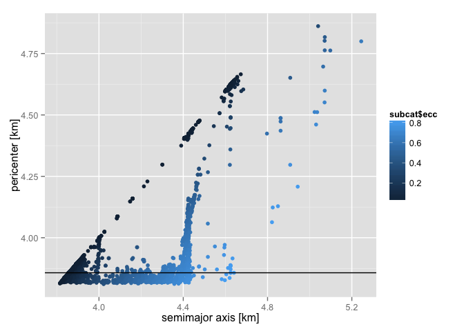
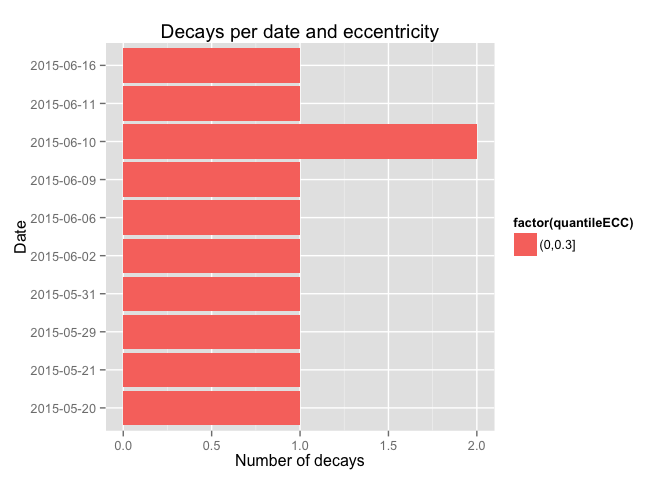
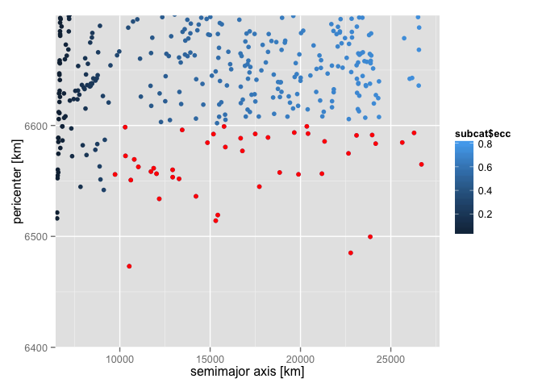
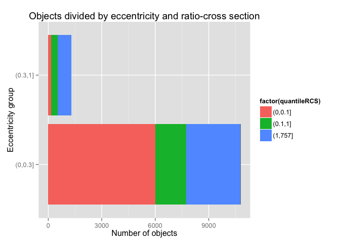

Satellite Orbit and Decay Analysis
======================================================

## Synopsis
Given the satellite orbits and physical parameters catalogue, we want to select those that are in eccentric orbits and are are going to re-enter the Earth atmosphere. That is the ratio-cross section must be greater that 1.0 and perigee less than 6600 km.


```r
library(dplyr)
```

```
## 
## Attaching package: 'dplyr'
## 
## The following object is masked from 'package:stats':
## 
##     filter
## 
## The following objects are masked from 'package:base':
## 
##     intersect, setdiff, setequal, union
```

```r
library(ggplot2)
library(Hmisc)
```

```
## Loading required package: grid
## Loading required package: lattice
## Loading required package: survival
## Loading required package: Formula
## 
## Attaching package: 'Hmisc'
## 
## The following objects are masked from 'package:dplyr':
## 
##     combine, src, summarize
## 
## The following objects are masked from 'package:base':
## 
##     format.pval, round.POSIXt, trunc.POSIXt, units
```

## Raw data

The catalog `tle_latest.txt` is taken form space-track.org:

```
## 0 VANGUARD 1
## 1 00005U 58002B   15147.38246589  .00000167  00000-0  20437-3 0  9996
## 2 00005 034.2503 160.5335 1846720 317.2671 029.7930 10.84612969  4653
## 0 VANGUARD 2
## 1 00011U 59001A   15148.17993544  .00000483  00000-0  24104-3 0  9997
## 2 00011 032.8754 148.0749 1469999 267.3589 075.8479 11.84944007397448
## =====================================================================
## Number of objects: 15090  (no. of rwos:    45270 )
```

The catalog `satcat.txt` (containing the physical parameters) comes from celestrak.com:

```
## 1957-001A    00001   D SL-1 R/B                  CIS    1957-10-04  TYMSC  1957-12-01     96.2   65.1     938     214   20.4200     
## 1957-001B    00002  *D SPUTNIK 1                 CIS    1957-10-04  TYMSC  1958-01-03     96.1   65.0     945     227     N/A       
## 1957-002A    00003  *D SPUTNIK 2                 CIS    1957-11-03  TYMSC  1958-04-14    103.7   65.3    1659     211    0.0800     
## =====================================================================
## Number of objects:    40666
```

An explanation fro the variables can be found in the docs folder.

### Process data
To process `TLE_LATEST.TXT` into a table containing the Keplerian orbital elements, create a symbolic link or a copy of it and name it `file.fla`.

```sh
rm -f file.txt
ln -s tle_latest.txt file.txt
```

Then, compile the fortran file `TLE2KEP.f90` (with gfortran, ifort, etc.) and run the executable to transform the 2 lines element catalog in a table format. The output is a file called `file_oe.fla`.

```sh
gfortran TLE2KEP.f90 -o TLE2KEP.x
./TLE2KEP.x
```

```
## NORAD_ID       sma_meter            ecc        inc_deg       RAAN_deg       argp_deg          M_deg
##        5    8620887.5280     0.18467200    34.25030000   160.53350000   317.26710000    29.79300000
##       11    8127119.0581     0.14699990    32.87540000   148.07490000   267.35890000    75.84790000
##       12    8321497.0627     0.16667160    32.90030000   329.54630000    90.77700000   288.32070000
##       16    8817636.0510     0.20236030    34.26150000    88.22490000     9.42980000   353.90280000
##       20    8267859.1364     0.16697420    33.34690000   282.42390000   188.42150000   168.46110000
## =====================================================================
## Number of objects: 15090
```


To process `SATCAT.TXT` we need change the delimiter of the table (missing values are represented by empty strings and not all can be recognised by R). Compile the fortran code `SAT2TABLE.f90` and run the executable. It will also add an header. The output is a file called `satcat.fla`.

```sh
gfortran SAT2TABLE.f90 -o SAT2TABLE.x
./SAT2TABLE.x
```

```
## head: satcat.fla[,1:8]: No such file or directory
## =====================================================================
## Number of objects: 40666
```

Read the data assigning the right format and merge the two catalogues (here using R)

```r
tlecat <- tbl_df(read.table(file = "file_oe.fla", header = TRUE, dec = "." ))
tlecat
```

```
## Source: local data frame [15,090 x 7]
## 
##    NORAD_ID sma_meter       ecc inc_deg RAAN_deg argp_deg    M_deg
## 1         5   8620888 0.1846720 34.2503 160.5335 317.2671  29.7930
## 2        11   8127119 0.1469999 32.8754 148.0749 267.3589  75.8479
## 3        12   8321497 0.1666716 32.9003 329.5463  90.7770 288.3207
## 4        16   8817636 0.2023603 34.2615  88.2249   9.4298 353.9028
## 5        20   8267859 0.1669742 33.3469 282.4239 188.4215 168.4611
## 6        22   6969779 0.0147761 50.2828 111.7523  55.4870 305.9927
## 7        29   7027076 0.0024662 48.3810  19.7667 255.9163 103.9007
## 8        45   7158688 0.0261385 66.6940 207.1203 221.0796 137.0364
## 9        46   7108647 0.0205205 66.6913 354.7749  66.5319 295.7211
## 10       47   7131275 0.0233446 66.6670  53.0557 215.9967 142.5224
## ..      ...       ...       ...     ...      ...      ...      ...
```

```r
satcat <- tbl_df(read.table(file = "satcat.fla", header = TRUE, dec = ".", sep = "|",na.string=""))
satcat$DECAY <- as.Date(satcat$DECAY)
satcat$LAUNCH <- as.Date(satcat$LAUNCH)
satcat
```

```
## Source: local data frame [34,940 x 14]
## 
##    NORAD_ID                  SATNAME      INTDES        TYPE     COUNTRY
## 1         1 SL-1 R/B                 1957-001A   ROCKET_BOBY CIS        
## 2         2 SPUTNIK 1                1957-001B       PAYLOAD CIS        
## 3         3 SPUTNIK 2                1957-002A       PAYLOAD CIS        
## 4         4 EXPLORER 1               1958-001A       PAYLOAD US         
## 5         5 VANGUARD 1               1958-002B       PAYLOAD US         
## 6         6 EXPLORER 3               1958-003A       PAYLOAD US         
## 7         7 SL-1 R/B                 1958-004A   ROCKET_BOBY CIS        
## 8         8 SPUTNIK 3                1958-004B       PAYLOAD CIS        
## 9         9 EXPLORER 4               1958-005A       PAYLOAD US         
## 10       10 SCORE                    1958-006A       PAYLOAD US         
## ..      ...                      ...         ...         ...         ...
## Variables not shown: LAUNCH (date), SITE (fctr), DECAY (date), PERIOD
##   (dbl), INCL (dbl), APO (dbl), PERI (dbl), RCS (dbl), STATUS (fctr)
```

```r
mergecat <- tbl_df(merge(tlecat,satcat,by=c("NORAD_ID")))
```

We are only interseted in a subset of the catalog:

```r
subcat <- select(mergecat,NORAD_ID,sma_meter,ecc,inc_deg,RAAN_deg,argp_deg,M_deg,LAUNCH,DECAY,RCS)
subcat
```

```
## Source: local data frame [12,090 x 10]
## 
##    NORAD_ID sma_meter       ecc inc_deg RAAN_deg argp_deg    M_deg
## 1         5   8620888 0.1846720 34.2503 160.5335 317.2671  29.7930
## 2        11   8127119 0.1469999 32.8754 148.0749 267.3589  75.8479
## 3        12   8321497 0.1666716 32.9003 329.5463  90.7770 288.3207
## 4        16   8817636 0.2023603 34.2615  88.2249   9.4298 353.9028
## 5        20   8267859 0.1669742 33.3469 282.4239 188.4215 168.4611
## 6        22   6969779 0.0147761 50.2828 111.7523  55.4870 305.9927
## 7        29   7027076 0.0024662 48.3810  19.7667 255.9163 103.9007
## 8        45   7158688 0.0261385 66.6940 207.1203 221.0796 137.0364
## 9        46   7108647 0.0205205 66.6913 354.7749  66.5319 295.7211
## 10       47   7131275 0.0233446 66.6670  53.0557 215.9967 142.5224
## ..      ...       ...       ...     ...      ...      ...      ...
## Variables not shown: LAUNCH (date), DECAY (date), RCS (dbl)
```

Here are some plots.

 

 

 

Let's see whose satellite/debris decay and when, their dimension (cross section) their eccentricity:

```r
sum(!is.na(subcat$DECAY))
```

```
## [1] 23
```

```r
subcat_decay <- filter(subcat, !is.na(DECAY))
subcat_decay <- group_by(subcat_decay,DECAY)
select(subcat_decay,DECAY,RCS,ecc)
```

```
## Source: local data frame [23 x 3]
## Groups: DECAY
## 
##         DECAY     RCS       ecc
## 1  2015-05-19  0.0210 0.0016683
## 2  2015-05-17 20.2147 0.0138252
## 3  2015-05-12 20.5450 0.0250272
## 4  2015-05-20  0.0240 0.0011825
## 5  2015-05-02  0.0300 0.0029296
## 6  2015-05-12  0.0410 0.0017044
## 7  2015-05-10  0.0138 0.0015881
## 8  2015-05-05  0.0050 0.0026762
## 9  2015-05-11  0.0107 0.0012247
## 10 2015-05-17  0.0101 0.0014400
## ..        ...     ...       ...
```

```r
subcat_decay$quantileRCS <- cut(subcat_decay$RCS,breaks=c(0,0.1,1.0,max(subcat_decay$RCS,na.rm=T)))
levels(subcat_decay$quantileRCS)
```

```
## [1] "(0,0.1]"  "(0.1,1]"  "(1,21.1]"
```

```r
subcat_decay$quantileECC <- cut(subcat_decay$ecc,breaks=c(0,0.3,1.0))
levels(subcat_decay$quantileECC)
```

```
## [1] "(0,0.3]" "(0.3,1]"
```

 

 

 

 

We are intersted at the big satellite which also decay. So at the end, there are NA that satisfy our conditions.

```r
filterd_cat <- filter(subcat_decay,RCS>1)
filterd_cat
```

```
## Source: local data frame [4 x 12]
## Groups: DECAY
## 
##   NORAD_ID sma_meter       ecc inc_deg RAAN_deg argp_deg    M_deg
## 1    22254   6592020 0.0138252  6.6390 261.2522 309.4478 248.3115
## 2    26986   6619832 0.0250272  7.1571 330.6596 300.2547 270.1524
## 3    40588   6774256 0.0005129 51.6423 216.7813 160.8192 199.3520
## 4    40619   6523494 0.0008840 51.6438 280.6115 127.8365 232.4708
## Variables not shown: LAUNCH (date), DECAY (date), RCS (dbl), quantileRCS
##   (fctr), quantileECC (fctr)
```
Of these ones, 0 are in HEO.

Finally, we look at the orbit with HEO and with perigee less than 6600 km.

```r
dim(subcat)
```

```
## [1] 12090    10
```

```r
sum(!is.na(subcat$ecc))
```

```
## [1] 12090
```

```r
subcat_ecc <- filter(subcat, !is.na(ecc) & ecc > 0.3 & sma_meter/1000*(1-ecc)<6600 )
select(subcat_ecc,sma_meter,ecc,DECAY,RCS)
```

```
## Source: local data frame [41 x 4]
## 
##    sma_meter       ecc DECAY     RCS
## 1   24986473 0.7400769  <NA>  4.2354
## 2   23976278 0.7280430  <NA> 14.6109
## 3   12070316 0.4563298  <NA>  0.7001
## 4   16754149 0.6066681  <NA> 11.1194
## 5   11091657 0.4082113  <NA>  2.9670
## 6   15903253 0.5858591  <NA> 29.7710
## 7   13386901 0.5107791  <NA> 12.0355
## 8   25274169 0.7440451  <NA>  6.0123
## 9   15506002 0.5798087  <NA> 10.5452
## 10  15385832 0.5711498  <NA>  2.9883
## ..       ...       ...   ...     ...
```

```r
subcat_ecc
```

```
## Source: local data frame [41 x 10]
## 
##    NORAD_ID sma_meter       ecc inc_deg RAAN_deg argp_deg    M_deg
## 1      6939  24986473 0.7400769 61.2535 270.9872  39.7788 355.6497
## 2     11007  23976278 0.7280430 62.3356  86.7326 256.6451  19.9008
## 3     11027  12070316 0.4563298 31.1107 291.0104 176.9034 174.6797
## 4     18571  16754149 0.6066681  6.8681 309.0981 119.4995  32.0853
## 5     20230  11091657 0.4082113 28.2733 339.6484 317.2041  49.7293
## 6     20874  15903253 0.5858591  7.5070 274.1242 180.3448 179.0600
## 7     21941  13386901 0.5107791  4.0295 327.6399 201.9644  31.5267
## 8     22020  25274169 0.7440451 61.2457 227.7898 220.1264 352.7983
## 9     22594  15506002 0.5798087 61.3500 220.2218 268.0896  28.6389
## 10    22996  15385832 0.5711498 28.6764 220.5987 271.5958  38.8510
## ..      ...       ...       ...     ...      ...      ...      ...
## Variables not shown: LAUNCH (date), DECAY (date), RCS (dbl)
```

 

 


```
## [1] "(0,0.1]" "(0.1,1]" "(1,757]"
```

```
## [1] "(0,0.3]" "(0.3,1]"
```

 

We are intersted at big satellite in HEO. So at the end, there are 35 that satisfy these conditions:

- eccentrycity > 0.3
- perigee < 6600 km
- retio cross section > 1.0


```r
filterd_cat <- filter(subcat_ecc,RCS>1 )
filterd_cat
```

```
## Source: local data frame [35 x 10]
## 
##    NORAD_ID sma_meter       ecc inc_deg RAAN_deg argp_deg    M_deg
## 1      6939  24986473 0.7400769 61.2535 270.9872  39.7788 355.6497
## 2     11007  23976278 0.7280430 62.3356  86.7326 256.6451  19.9008
## 3     18571  16754149 0.6066681  6.8681 309.0981 119.4995  32.0853
## 4     20230  11091657 0.4082113 28.2733 339.6484 317.2041  49.7293
## 5     20874  15903253 0.5858591  7.5070 274.1242 180.3448 179.0600
## 6     21941  13386901 0.5107791  4.0295 327.6399 201.9644  31.5267
## 7     22020  25274169 0.7440451 61.2457 227.7898 220.1264 352.7983
## 8     22594  15506002 0.5798087 61.3500 220.2218 268.0896  28.6389
## 9     22996  15385832 0.5711498 28.6764 220.5987 271.5958  38.8510
## 10    25843  12410245 0.4703264  6.5812 152.3054 338.2296   7.3372
## ..      ...       ...       ...     ...      ...      ...      ...
## Variables not shown: LAUNCH (date), DECAY (date), RCS (dbl)
```

```r
write.table(filterd_cat[,1:10], file = "heo_sat.txt", row.name = FALSE, sep = "\t")
```
Of these ones, 0 are expected to decay.

Check the file

```r
tmp <- tbl_df(read.table("heo_sat.txt",sep='\t',header=TRUE))
tmp
```

```
## Source: local data frame [35 x 10]
## 
##    NORAD_ID sma_meter       ecc inc_deg RAAN_deg argp_deg    M_deg
## 1      6939  24986473 0.7400769 61.2535 270.9872  39.7788 355.6497
## 2     11007  23976278 0.7280430 62.3356  86.7326 256.6451  19.9008
## 3     18571  16754149 0.6066681  6.8681 309.0981 119.4995  32.0853
## 4     20230  11091657 0.4082113 28.2733 339.6484 317.2041  49.7293
## 5     20874  15903253 0.5858591  7.5070 274.1242 180.3448 179.0600
## 6     21941  13386901 0.5107791  4.0295 327.6399 201.9644  31.5267
## 7     22020  25274169 0.7440451 61.2457 227.7898 220.1264 352.7983
## 8     22594  15506002 0.5798087 61.3500 220.2218 268.0896  28.6389
## 9     22996  15385832 0.5711498 28.6764 220.5987 271.5958  38.8510
## 10    25843  12410245 0.4703264  6.5812 152.3054 338.2296   7.3372
## ..      ...       ...       ...     ...      ...      ...      ...
## Variables not shown: LAUNCH (fctr), DECAY (lgl), RCS (dbl)
```

We finish writing the entire `subcat` data frame into a file:

```r
write.table(subcat[,1:10], file = "orbitsat.txt", row.name = FALSE, sep = "\t")
```
